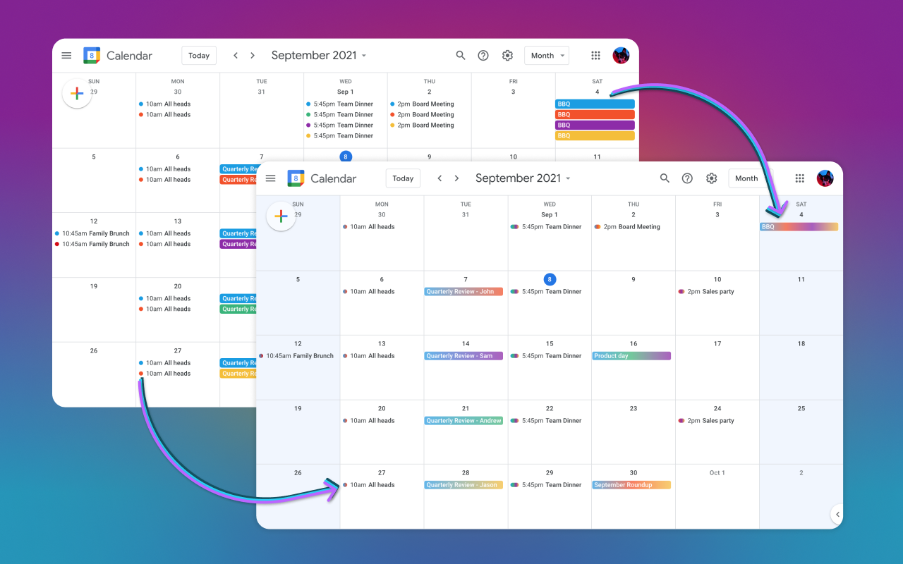

# Rainbow.surf for Google Calendar
  

Free Chrome extension to clean Google Calendar with some much needed color

- 📅📅 → 📅 merges duplicate Google Calendar events into one rainbow of the individual calendar colors 
- 👩‍👦‍👦 clutter cutter for teams and families using calendar sharing
- 🟦 makes weekends great again - with cool blue background colors
- 🗓 new event box & mini calendar views also get cool blue weekends
- 💻 does not modify events (only works in your browser)
- 🚫 doesn't show ads and doesn't send user's data anywhere
- 🌼 open source: https://github.com/coedit/gcal-rainbow-surf

## [Add to Chrome] = Presto Chango!

Report bugs here: https://github.com/coedit/gcal-rainbow-surf/issues  
Have ideas for new Google Calendar enhancements? please tell us

Passion project – curated by @ezdub – dedicated to @illstylist  
code by @imightbeAmy @karjna @rubenpoppe @msteffen @ezdub  
art copyright ©2021 @ezdub  

